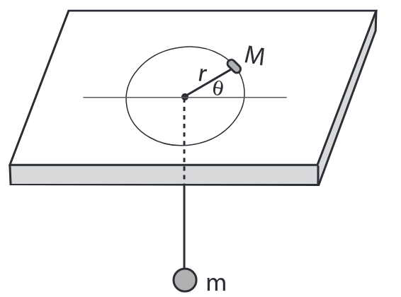

# Rotating mass on a table
A simulation of a mass rotating on a table attached to a mass under the table

The set up looks like this:

# Dependencies
	- [gtkmm3](https://www.archlinux.org/packages/?name=gtkmm3) for gtk
	- [boost](https://www.archlinux.org/packages/extra/x86_64/boost/) for logging (which is not implemented)
